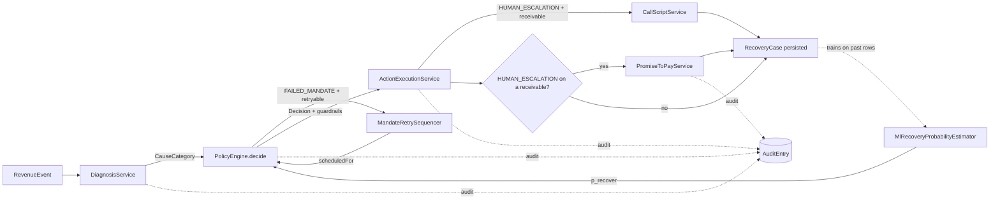
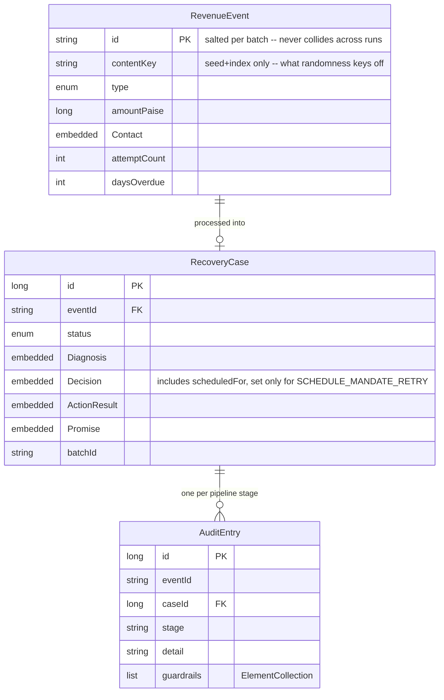

# Architecture

## Pipeline overview

Every `RevenueEvent` moves through the same four stages, synchronously, inside one
service (`RecoveryPipelineService.processOne`). Each stage writes one `AuditEntry`
row before the next stage runs, so the audit trail reflects the actual order of
operations, not a reconstruction after the fact.

- **DiagnosisService** is rule-based (decline-code / days-overdue lookup tables).
  It may call `GroqClient` to narrate an ambiguous checkout abandonment in one
  sentence for the dashboard, but the `CauseCategory` itself never comes from the
  LLM call — if Groq is unreachable or unconfigured, diagnosis is unaffected.
- **PolicyEngine** is the only place an intervention is chosen. It is a plain Java
  class with no I/O, which is what makes `PolicyEngineTest` possible: every
  guardrail is a pure function of `(RevenueEvent, InterventionType, now)`. For a
  `FAILED_MANDATE` diagnosed as transient-retryable, it defers to
  **MandateRetrySequencer** instead of retrying immediately in the same pass.
- **MandateRetrySequencer** is a pure, stateless utility: given an attempt count
  and "now", it returns the next retry date on a fixed +1/+3/+7-day cadence (or
  reports the sequence exhausted). No I/O, no persistence of its own — the
  schedule is just a value on `Decision`, and it's up to the *next* batch run
  (whenever that happens) to notice the retry is due.
- **ActionExecutionService** executes exactly one intervention through
  `PaymentGateway` (payment-related), `MessagingService` (copy rendering),
  `CallScriptService` (Hinglish call script, only for `HUMAN_ESCALATION` on an
  `OVERDUE_RECEIVABLE`), or an internal queue log (human escalation / risk
  routing / scheduled retry). Messaging and call scripts are always
  simulated/generated-only — logged, never dispatched or actually called.
- **PromiseToPayService** only runs for `HUMAN_ESCALATION` on an
  `OVERDUE_RECEIVABLE`, simulating whether a verbal commitment from a collections
  call materializes.
- **MlRecoveryProbabilityEstimator** supplies the one number PolicyEngine doesn't
  compute itself: p_recover. See "Machine learning" below.

## Why a policy engine instead of an LLM here

An LLM choosing whether to retry a payment, escalate a receivable, or stop pursuing
a customer is exactly the failure mode the "AI judgment" criterion in the
submission bar is checking for: non-deterministic, hard to unit test, and hard to
explain to a merchant when it gets it wrong. `PolicyEngine` is deliberately boring:
a lookup table for base intervention per cause category, three compliance
overrides (DND, quiet hours, stale-pursuit escalation) applied in a fixed order,
and a final cost-vs-expected-value check. Every one of those five guardrails has
its own method and its own test. The LLM's job is narration (`DiagnosisService`)
and copy personalization (`MessagingService`) — text a human reviews, not money
that moves.

## Machine learning: recovery-probability model

`AssumedRecoveryRates` started as the only source for p_recover: seven hand-picked
constants, one per `CauseCategory`, documented as assumptions rather than measured
rates. `MlRecoveryProbabilityEstimator` replaces that with a real model wherever
there's enough data to trust one, while keeping the constants as the honest
fallback -- the estimator interface (`RecoveryProbabilityEstimator`) means
`PolicyEngine` doesn't know or care which one is answering.

**Model**: `LogisticRegressionModel` -- sigmoid(w . x), fit by batch gradient
descent with L2 regularization, implemented in ~70 lines of plain Java. No ML
library. The reason isn't "we didn't have time to add one" -- it's that this
model's entire job is to hand `PolicyEngine` one interpretable number for a
guardrail check, and a coefficient vector you can print and read off (`model.getWeights()`)
is worth more here than a marginally better black box would be. Same
reasoning as keeping the LLM out of `PolicyEngine` itself.

**Features** (`RecoveryFeatures`, 12 dimensions): a bias term, a one-hot
encoding of `CauseCategory` (7 dims), and four scaled numeric features --
log(amount), days overdue, attempt count, B2B flag. One unified model across
all categories rather than one model per category, so it can learn cross-category
structure (e.g. "large amounts recover less often") on top of each category's
own baseline.

**Training data**: `MlRecoveryProbabilityEstimator.TRAINABLE` is a deliberately
narrow set of interventions -- `RETRY_PAYMENT`, `SEND_ALT_PAYMENT_LINK`, the three
reminder channels, `HUMAN_ESCALATION`. Excluded on purpose:
- `MARK_DO_NOT_CONTACT` / `STOP_PURSUIT` / `ROUTE_TO_RISK_TEAM` / `DEFER_QUIET_HOURS`
  -- no recovery attempt happened, so there's no outcome to learn from.
- `SCHEDULE_MANDATE_RETRY` -- the outcome is *censored*: it's scheduled for a
  future batch run, and "not recovered yet" is not the same label as "failed".
  Training on these as negatives would teach the model that mandates never recover.

Label is simply `recoveredAmountPaise > 0`. Below `MIN_TRAINING_SAMPLES` (30),
`trainOn(...)` is a no-op and the estimator stays on `AssumedRecoveryRates`.

**Retraining cadence**: synchronous, at the top of every `POST /api/batches/run`,
on all qualifying history *before* that batch's own events are generated -- see
`BatchController.run()`. Fine at this scale (a few thousand rows, gradient descent
in low milliseconds); not how you'd run it against a real production table (see
Extension points).

**A bug this approach caught, worth walking through**: after the first real
training run, `/api/model/status` showed `FRAUD_SUSPECTED` at ~37% predicted
recovery against an assumed 0%. Root cause: `FRAUD_SUSPECTED` cases are always
routed via `ROUTE_TO_RISK_TEAM`, which is excluded from `TRAINABLE` -- so that
category's one-hot weight never receives a gradient update and sits at exactly
the zero it was initialized to. At prediction time, the *other* learned weights
(bias, amount, etc., fit from every non-fraud example) still contribute, so the
model produced a number anyway -- a textbook case of a model extrapolating past
its own training distribution instead of admitting it. `PolicyEngine` was never
actually at risk (fraud's path never reads the probability at all: see the
`active` flag), but the display was misleading, and a differently-wired model
consulted more directly could have made a real mistake here. Fixed by pinning
`FRAUD_SUSPECTED` to `AssumedRecoveryRates` explicitly, regardless of training
state, and locked in with a regression test.

## Data model

`RecoveryCase` embeds its `Diagnosis` / `Decision` / `ActionResult` / `Promise`
rather than relating to separate tables — a case is written exactly once, after
the full pipeline has run for that event, so there's no need for those to be
independently queryable rows. `AuditEntry` is the append-only, independently
queryable side: one row per stage, so a case's history is inspectable even if you
only have its audit rows and not the final case (useful if a batch run is
interrupted mid-way).

`Diagnosis.reasoning` and `Decision.reasoning` are both embedded on `RecoveryCase`
and both named `reasoning` — resolved with `@AttributeOverride` to distinct
columns (`diagnosis_reasoning` / `decision_reasoning`) rather than renaming the
fields on the embeddables themselves, since `Diagnosis` and `Decision` are also
used standalone (e.g. in `PolicyEngineTest`) where `reasoning` is the natural name.

## Gateway abstraction

`PaymentGateway` has two implementations, selected once at startup by
`GatewayConfig` based on whether `RAZORPAY_KEY_ID` / `RAZORPAY_KEY_SECRET` are set:

- `SimulatedPaymentGateway` seeds a `Random` from a SHA-256 hash of the event's
  `contentKey` (deliberately *not* `id`, which is salted per batch to avoid
  primary-key collisions and would otherwise make the same seed recover a
  different amount on every run), so outcomes are reproducible across runs (same
  seed in, same recovered-amount metrics out) without needing a real gateway
  call. Its success probability per category is read from
  `AssumedRecoveryRates.forCategory(...)` -- the same ground truth
  `MlRecoveryProbabilityEstimator` is trying to learn to approximate from
  nothing but observed (features, outcome) pairs, the same setup a model
  trained on real historical data would face. `PromiseToPayService` follows
  the same `contentKey`-not-`id` rule for the same reason.
- `RazorpayTestModeGateway` creates a genuine Razorpay test-mode Payment Link
  (`razorpay-java`, `client.paymentLink.create(...)`). This is a real API call
  against Razorpay's test environment, not a mock.

## Request-boundary hardening

Two things found by deliberately trying to break the API, not by inspection:

- `GET /api/cases` used to paginate *before* filtering by status, so a status
  filter only ever looked inside whatever one page happened to return --
  correct by accident for small batches, silently wrong for anything larger
  than one page. Fixed by pushing the filter into the query
  (`findByBatchIdAndStatus`) instead of filtering the page's contents in
  memory. `RecoveryCaseRepositoryTest` proves `getTotalElements()` reflects
  every matching row, not just what fits on the requested page.
- `POST /api/batches/run`'s `size` had no upper bound -- the whole batch runs
  inside one HTTP request and one transaction, so an unbounded size is a
  self-inflicted denial of service on a single-instance demo server. Bounded
  to 1-2000 via `@Validated` + `@Min`/`@Max` (the `spring-boot-starter-validation`
  dependency was already pulled in but unused until this). Malformed inputs
  generally (bad status enum values, a non-numeric case id) now return 400
  through `ApiExceptionHandler` instead of leaking a 500.

## Extension points (explicitly out of scope for this build)

- **Resolving real payment outcomes.** `RazorpayTestModeGateway` reports a created
  link as `pending` — whether the customer actually pays resolves asynchronously,
  which needs a webhook receiver (`payment_link.paid` event) updating the
  `RecoveryCase` row after the fact. A batch-demo CLI/dashboard has no long-running
  listener, so this is simulated instead of built.
- **Real messaging dispatch.** `MessagingService` renders copy and
  `ActionExecutionService` logs it as `[SIMULATED SEND]`; wiring an actual SMS/
  WhatsApp/email provider is a credentials-and-compliance question (opt-in
  verification, template approval on WhatsApp Business API) that's out of scope
  for a hackathon build but is a natural next step.
- **Production-scale model retraining.** `MlRecoveryProbabilityEstimator` retrains
  synchronously inside every batch-run request, which is fine at this scale but
  wouldn't be how you'd run it against a real, growing production table --
  that would want a scheduled/async retraining job instead, plus a held-out
  validation split and drift monitoring, none of which a hackathon-scale demo
  needs. The model itself already trains on real (simulated) historical
  outcomes, not just assumed constants -- see "Machine learning" above.
- **JWT/OAuth2 on the API.** The current gate (`ApiKeyFilter`) is a single shared
  key on mutating endpoints, sufficient for a single-merchant demo. A real
  deployment would authenticate per-merchant, matching the JWT/OAuth2 pattern
  already used in the author's other projects.
- **Actual voice calls.** `CallScriptService` generates the Hinglish script a
  collections agent would read; it does not place a call. Wiring real telephony
  (outbound dialing, TTS, and ASR to actually run the call as a voice bot) is a
  distinct, much larger integration (e.g. a telephony provider + speech stack)
  that's out of scope for this build -- the script itself is the artifact a human
  agent can use today, and is the natural first half of a future voice-bot build.
